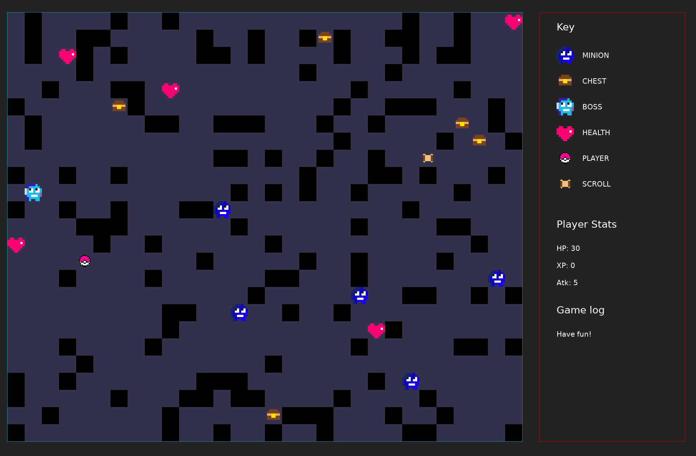
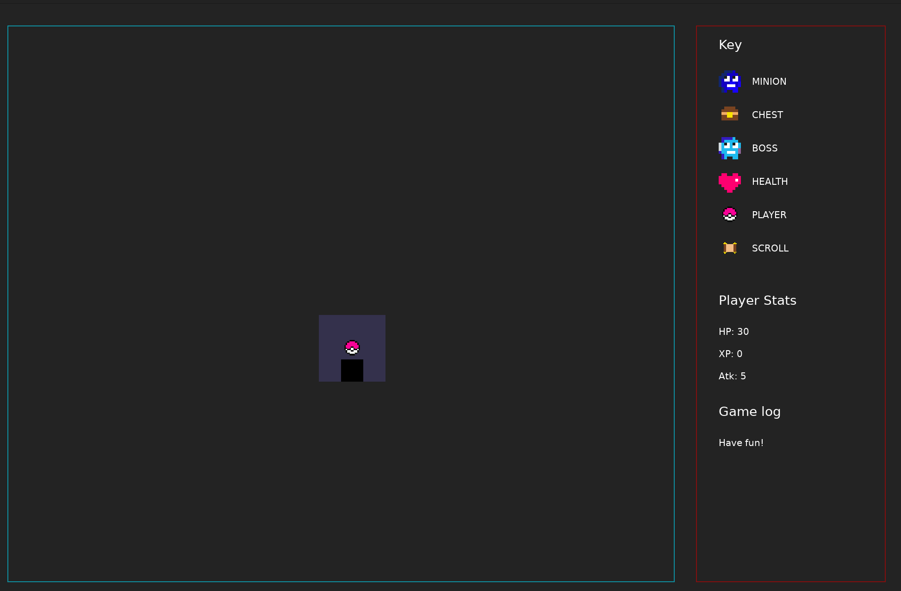

# Love Rogue

A roguelike dungeon crawler game written in Lua using [Love2d](https://love2d.org/).

### **Full View**



### **Narrow View**



## Instructions/Rules

1. `BOSS` -- the MF that you have to beat to win the game ;)
2. `MINION` -- the boss's henchmen. Fight the henchmen to earn XPs
3. `PLAYER` -- this is you
4. `HEALTH` -- to earn health points
5. `CHEST` -- to earn atk points
6. `SCROLL` -- to see the dungeon in full view

**note** -- you need a big screen to play this game

That is all. Have fun!

## Shortcuts and bindings

<kbd>Q</kbd> -- Exit the game\
`Arrow Keys` or `WASD` -- to move player

## Ubuntu Prerequisites

- [Love2d](https://launchpad.net/~bartbes/+archive/ubuntu/love-stable)
- [Lua](https://www.lua.org/download.html)
- [Love2d Support](https://marketplace.visualstudio.com/items?itemName=pixelbyte-studios.pixelbyte-love2d) (optional)

## How to run

Terminal

```bash
$ love src .
```

VSCode (Optional -- you need the [Love2d Support](#ubuntu-prerequisites) extension to use this feature )

```bash
# open main.lua first
Alt+L
```

**note** -- make sure to check the extension setting to see if the file path matches what is in your OS
