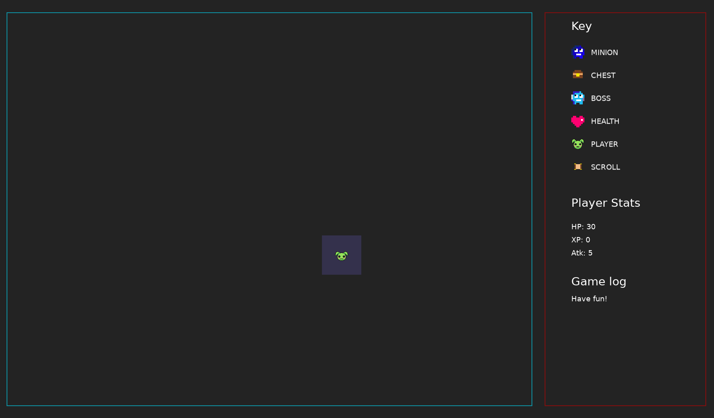

# Rogueward Bound

Dive into the depths of an engaging roguelike dungeon crawler, crafted with Lua and fueled by the dynamic [Love2d](https://love2d.org/) game engine. Journey through intricate mazes, face challenging foes, and embark on an adventurous experience where every step and decision shape your fate.

### Full View


### Narrow View



Give it a try by clicking [here](https://pacna.github.io/rogueward-bound/).

## Instructions/Rules

1. `BOSS` -- the MF that you have to beat to win the game ;)
2. `MINION` -- the boss's henchmen. Fight the henchmen to earn XPs
3. `PLAYER` -- this is you
4. `HEALTH` -- to earn health points
5. `CHEST` -- to earn atk points
6. `SCROLL` -- to see the dungeon in full view

**Note:** You need a big screen to play this game.

## Shortcuts and bindings

-   <kbd>Q</kbd> -- Exit the game
-   `Arrow Keys` or `WASD` -- to move player

## Ubuntu Prerequisites

1.  [Love2d](https://launchpad.net/~bartbes/+archive/ubuntu/love-stable)
2.  [Lua](https://www.lua.org/download.html)
3.  [Make](https://www.gnu.org/software/make/)
4.  [Love2d Support](https://marketplace.visualstudio.com/items?itemName=pixelbyte-studios.pixelbyte-love2d) (optional)

## Playing the Game

To start and play the game, use the following command in your terminal:

```bash
$ make run
```

## VSCode (Optional)

1. Open `main.lua` first.
2. Press `Alt + L`

**Note:** Ensure that the file path in the extension settings matches your OS.
